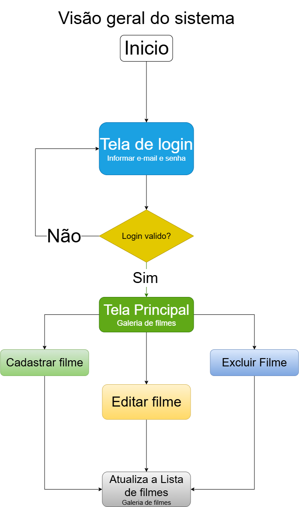

# Projeto de Catálogo de Filmes

**Nome do Projeto**: Catálogo de Filmes  
**Equipe de Desenvolvimento**: Fernando

## Visão Geral do Sistema (Escopo)

O **Catálogo de Filmes** tem como objetivo permitir que o usuário possa organizar seus filmes em uma coleção pessoal, podendo cadastrar, visualizar, editar e excluir filmes, e adicionar a capa de cada filme.

## Regras de negocio (RN)

**RN01**:O sistema deve gerenciar o cadastro dos
 usuários, as informações necessarias são:

- ID
- Nome
- E-mail
- Senha

**RN02**: O sistema deve permitir que os usuários realizem login
 no sistema utilizando e-mail e senha.

**RN03**:O sistema deve permitir que os usuários
 cadastrem filmes com as seguintes informações:

- ID
- Nome
- Ano de lançamento
- Nota
- Capa do filme

**RN04**: A nota do filme deve estar entre 0 e 10.

**RN05**: O sistema deve permitir que o usuário visualize
 sua coleção de filmes, mostrando as informações
  cadastradas e a capa do filme.

  **RN06**: O sistema deve permitir que o usuário edite as
  informações de um filme ja cadastrado.

**RN07**: O sistema deve permitir que o usuário exclua um
filme de sua coleção.

## Requisitos Funcionais (RF)

**RF01**: O sistema deve permitir o cadastro de usuários.

**RF02**: O sistema deve permitir que o usuário faça login.

**RF03**: O sistema deve permitir o cadastro de filmes.

**RF04**: O sistema deve permitir a visualização dos filmes
 cadastrados.

 **RF05**: O sistema deve permitir a edição dos filmes.

 **RF06**: O sistema deve permitir a exclusão dos filmes.

 **RF07**: O sistema deve permitir o envio da capa do filme.

 ## Requisitos Não Funcionais (RNF)

 **RNF01**: O sistema deve ter uma interface simples e fácil
  de usar.

  **RNF02**: O sistema deve proteger o acesso dos usuários
   através de login e senha.

   **RNF03**: O sistema deve permitir o armazenamento das informações dos filmes em um banco de dados.

   
